# 🛡️ CUT Safety

<p align="center">
  
  
  
  
</p>

<h1 align="center">CUT Safety</h1>

<p align="center">
A Flutter mobile application for the <strong>Central University of Technology (CUT)</strong> community to report incidents, share safety updates, and coordinate through groups, backed by a role-protected Security interface for campus safety personnel.
</p>

---

# 📖 Overview

**CUT Safety** is a cross-platform mobile app built with **Flutter** and **Dart**, designed to keep the CUT student community connected and informed on campus safety. Users can report incidents, post safety updates, and organise through groups, all in real time.

The app has two distinct experiences behind a single login: a **User** interface for the general student community, and a **Security** interface, role-protected and reserved for campus security personnel, with tools tailored to monitoring and responding to incidents. Both roles authenticate the same way, but the app routes them into entirely different interfaces based on their assigned role.

The application integrates with **Firebase Authentication**, **Cloud Firestore**, and **Firebase Storage** for real-time data, secure accounts, and media handling.

---

# ✨ Features

## 🚨 Alerts & Updates (User)

- Post and browse incident alerts by category
- Share general safety updates
- Location-tagged reports
- Real-time report counts

---

## 🆘 SOS & Emergency

- One-tap SOS trigger for emergencies
- Push notifications to relevant users on SOS activation

---

## 🗺️ Maps & Location

- Live map screen showing the user's current location
- Distance calculation from the user's registered campus

---

## 👥 Groups & Chat (User)

- Discover and join community groups
- Create groups (open or restricted)
- Real-time group chat
- Group membership management

---

## 🛡️ Security Interface (RBA-Protected)

- Separate, role-gated interface for campus security personnel
- Same login flow as regular users, routed by role, not a separate app
- View and respond to reported alerts
- Monitor live incident activity across campus
- Elevated visibility into reports not available to standard users

---

## 👤 Profile

- View and edit profile details
- Profile photo upload
- Campus affiliation
- Sign-out and session management

---

## 🔐 Security & Access Control

- Firebase Authentication (Email/Password)
- Role-based routing (User vs. Security)
- Firestore security rules enforced per-collection
- Authenticated-only reads/writes across the app

---

# 🛠️ Tech Stack

| Technology | Purpose |
|------------|---------|
| Dart | Programming Language |
| Flutter | Cross-Platform App Framework |
| Provider | State Management |
| Firebase Authentication | Authentication |
| Cloud Firestore | Real-Time Database |
| Firebase Storage | Media Storage (profile photos, etc.) |
| FlutterFire CLI | Firebase Configuration |
| Android Studio / VS Code | Development Environment |

---

# 🖼️ Gallery

### Splash &nbsp;·&nbsp; Login
<p align="center">
  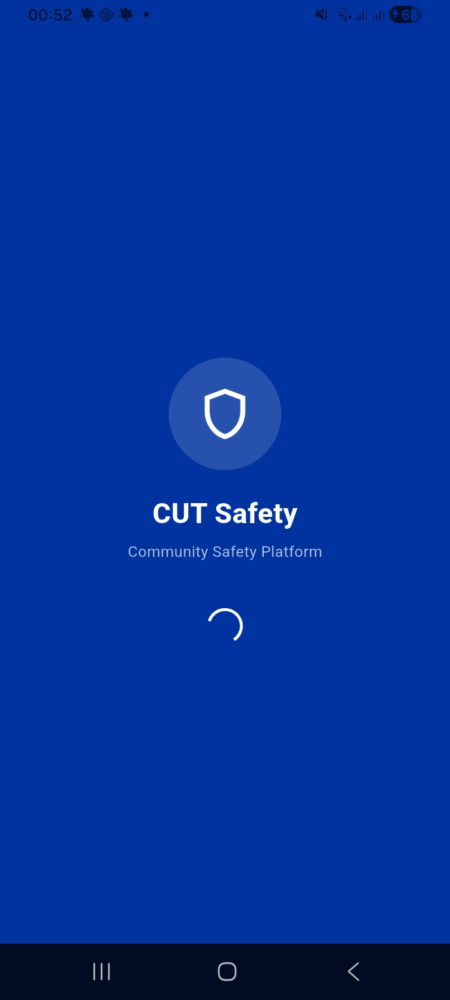
  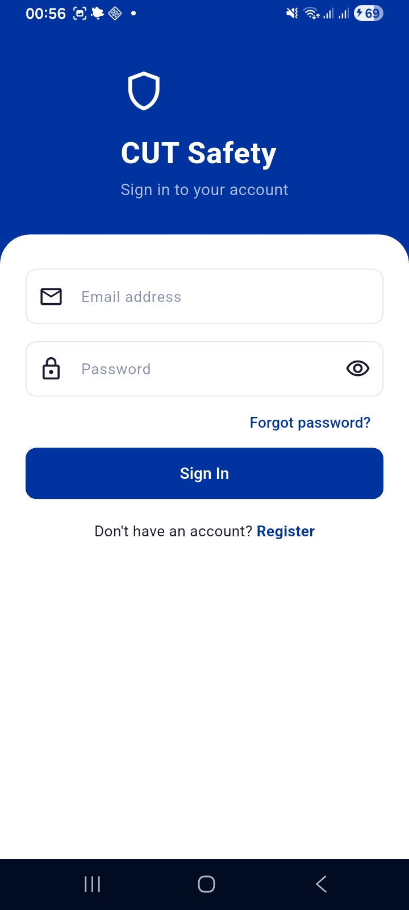
</p>

### Alerts Feed &nbsp;·&nbsp; Safety Map
<p align="center">
  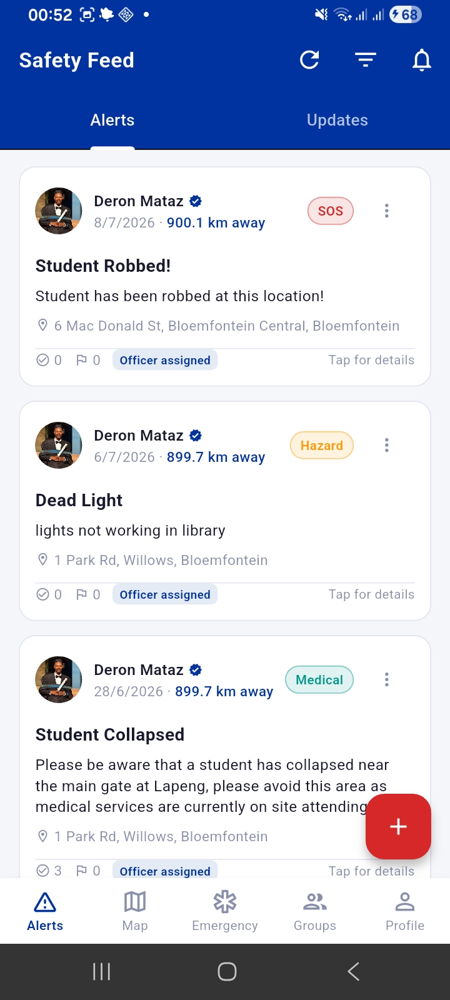
  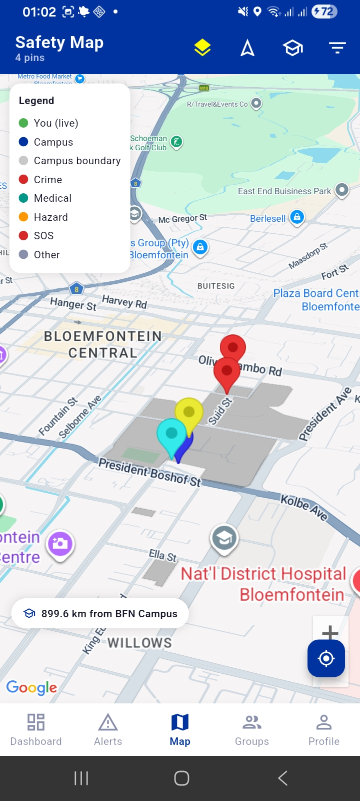
</p>

### Groups &nbsp;·&nbsp; Group Chat
<p align="center">
  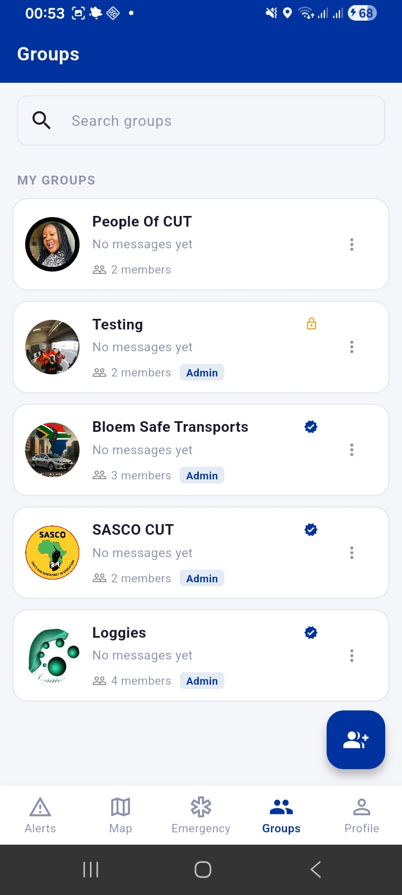
  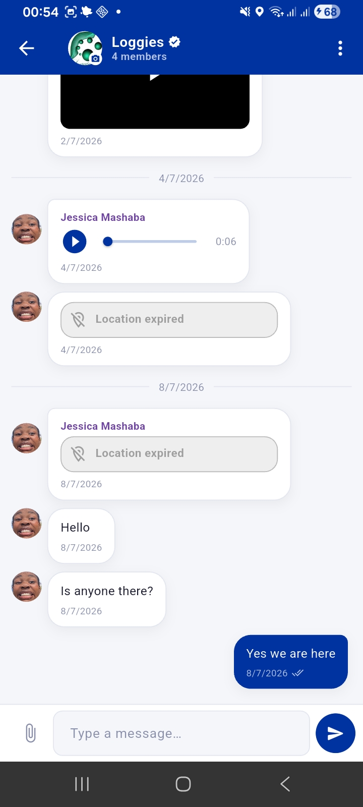
</p>

### Group Members &nbsp;·&nbsp; Register
<p align="center">
  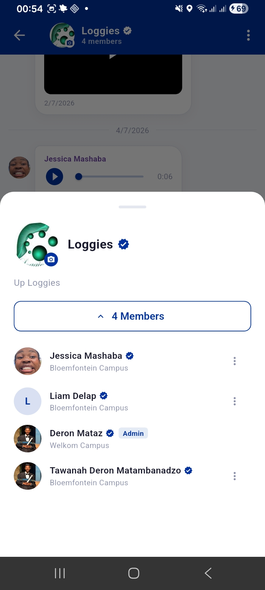
  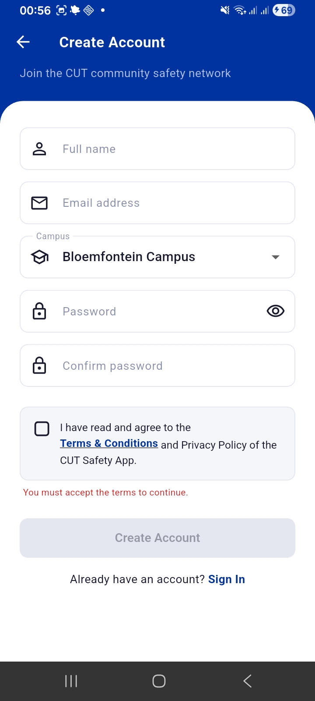
</p>

### SOS & Quick Dial &nbsp;·&nbsp; Settings
<p align="center">
  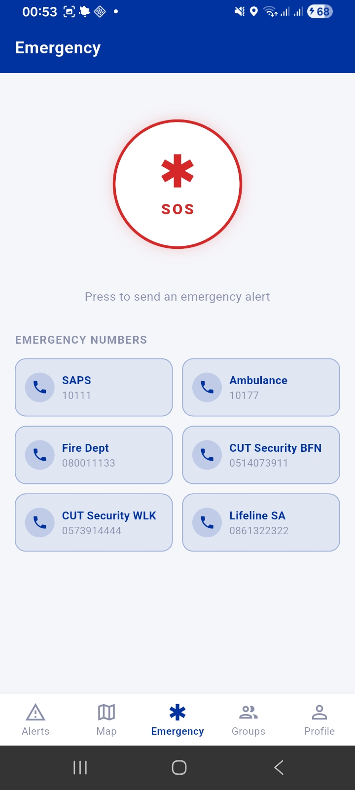
  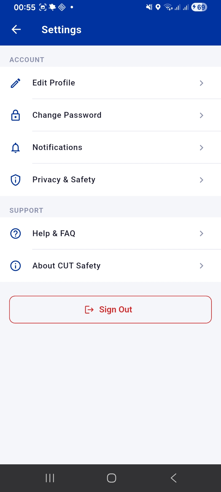
</p>

### Profile &nbsp;·&nbsp; Security Dashboard
<p align="center">
  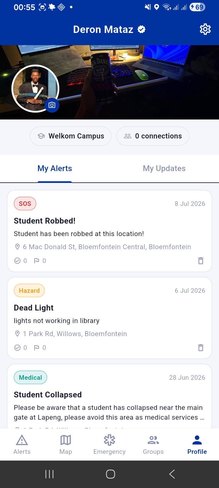
  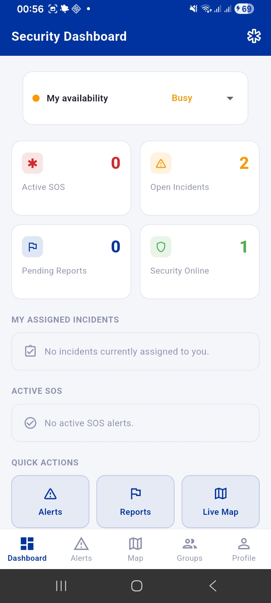
</p>

### Security Report View &nbsp;
<p align="center">
  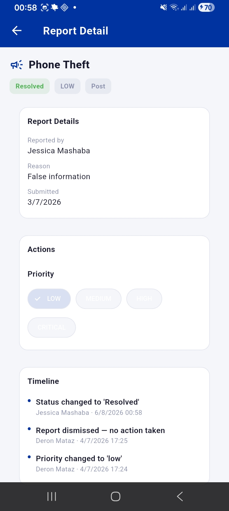
</p>

---

# 🏗️ Project Structure

```text
lib/
├── main.dart                        # App entry point, provider setup
├── firebase_options.dart            # Firebase credentials (auto-generated by FlutterFire CLI)
│
├── theme/
│   └── app_theme.dart               # CUT brand colours, typography, component styles
│
├── models/
│   ├── user_model.dart              # UserModel + Firestore serialization
│   ├── alert_model.dart             # AlertModel + AlertCategory enum
│   └── group_model.dart             # GroupModel, GroupMessage, UpdateModel
│
├── services/
│   └── firebase_service.dart        # All Firestore/Auth/Storage CRUD methods
│
├── providers/
│   ├── user_provider.dart           # Auth state + profile + role management
│   ├── alert_provider.dart          # Alerts feed + updates feed
│   └── group_provider.dart          # Groups list + join/leave
│
├── widgets/
│   └── common_widgets.dart          # Shared: UserAvatar, TimeAgoText, CategoryBadge,
│                                     #         LocationRow, EmptyState, SectionHeader
│
└── screens/
    ├── splash_screen.dart           # Cold-start loader + role-based auth routing
    ├── home_screen.dart             # Bottom nav shell (Alerts / Groups / Profile)
    ├── auth/
    │   ├── login_screen.dart        # Shared email + password login for all roles
    │   └── register_screen.dart     # New account registration
    ├── alerts/
    │   ├── alerts_screen.dart       # Tabbed feed: Alerts | Updates
    │   ├── post_alert_sheet.dart    # Bottom sheet: post a new alert
    │   └── post_update_sheet.dart   # Bottom sheet: post a safety update
    ├── groups/
    │   ├── groups_screen.dart       # Group discovery + my groups
    │   ├── create_group_sheet.dart  # Bottom sheet: create a group
    │   └── chat_screen.dart         # Real-time group chat
    ├── security/
    │   └── security_dashboard_screen.dart  # RBA-protected security interface
    └── profile/
        └── profile_screen.dart      # Profile view + edit sheet + sign-out
```

---

# 🔐 Role-Based Access (RBA)

Both **Users** and **Security** personnel log in through the same screen. Once authenticated, the app reads the user's role and routes them into the appropriate interface.

### 👤 User

- Access to Alerts, Updates, Groups, and Profile
- Can post alerts and safety updates
- Can create and join groups
- No access to the Security interface

---

### 🛡️ Security

- Access to the standard user interface, plus a dedicated Security dashboard
- Elevated visibility into reported alerts and incidents
- Monitors live campus safety activity
- Role is assigned server-side and enforced via Firestore rules — not user-selectable

---

# 🗄️ Firestore Data Model

| Collection | Document ID | Key fields |
|------------|-------------|------------|
| `users`    | `uid`       | name, email, campus, role, photoUrl, createdAt |
| `alerts`   | auto        | userId, title, description, location, category, reportCount, createdAt |
| `updates`  | auto        | userId, content, location, createdAt |
| `groups`   | auto        | name, description, adminId, type, memberIds, createdAt |
| `groups/{id}/messages` | auto | userId, text, createdAt |

---

# 🎨 Brand Colours

| Token     | Hex       | Usage                          |
|-----------|-----------|---------------------------------|
| CUT Blue  | `#0033A0` | Primary, app bar, buttons      |
| CUT Red   | `#D62828` | Alerts, danger actions         |
| White     | `#FFFFFF` | Cards, surfaces                |
| Grey      | `#F5F6FA` | Scaffold background            |
| Dark      | `#1A1A2E` | Body text                      |
| Muted     | `#8A8FAB` | Secondary text, icons          |
| Border    | `#E4E6F0` | Dividers, card borders         |

---

# 📌 Future Improvements

- Campus-based filtering for alerts and updates (e.g. Welkom students shouldn't see Bloemfontein-only alerts)
- Security incident response workflow
- Analytics dashboard for Security role
- In-app reporting history and status tracking
- Offline support for viewing recent alerts

---

# 🚫 Proprietary Software — All Rights Reserved

This repository and its contents are **private and proprietary**. This is **not open-source software**, and **no license is granted** for its use, copying, modification, or distribution.

- ❌ No permission to use, copy, modify, merge, publish, distribute, sublicense, or sell copies of this software.
- ❌ No permission to deploy or run this software in any environment other than its intended, authorized use.
- ❌ No implied license is granted by the visibility of this repository or its source code.

All rights to this software, including all source code, designs, and associated assets, are reserved exclusively by the copyright holder. Unauthorized use, reproduction, or distribution may result in legal action.

© All Rights Reserved.

---

# 👨‍💻 Developer

**Deron Mataz**

Software Developer

GitHub: https://github.com/Deron-Mataz

---

<p align="center">
Built with ❤️ using Flutter, Dart and Firebase.
</p>
